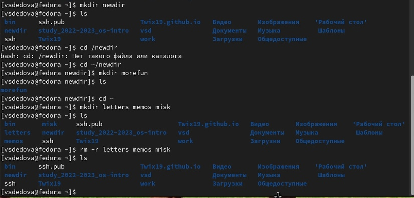

---
## Front matter
lang: ru-RU
title: Структура научной презентации
subtitle: Презентация на тему:взаимодействие пользователя с системой посредством командной строки.
author:
  - Дедова В.С.
institute:
  - Российский университет дружбы народов, Москва, Россия
date: 03 марта 2023

## i18n babel
babel-lang: russian
babel-otherlangs: english

## Formatting pdf
toc: false
toc-title: Содержание
slide_level: 10
aspectratio: 169
section-titles: true
theme: metropolis
header-includes: |
---
  - |
    ````{=latex}
    \metroset{progressbar=frametitle,sectionpage=progressbar,numbering=fraction}
    \beame@ignorenonframefalse
    \makeatletter
    \makeatother
    ````
---

## Цель работы
Приобретение практических навыков взаимодействия пользователя с системой посредством командной строки.

## Выполнение  работы

##Определение  полного имени  нашего домашнего каталога,Переходим  в каталог /tmp.Выводим  на экран содержимое каталога /tmp. Для этого используем команду ls с различными опциями. Определяем, есть ли в каталоге /var/spool подкаталог с им


##В домашнем каталоге создаём новый каталог с именем newdir.В каталоге ~/newdir с letters, memos, misk. Затем удаляем эти каталоги одной командой. Удаляем созанн



##С помощью команды man определите, какую опцию команды ls нужно использовать для.Определяем набор опций команды ls


##Определяем набор опций команд cd, mkdir,rmdir, rm.


##Используя информацию, полученную при помощи команды history, выполните модифика


##Вывод
На данной лабораторной работе я приобрела  практические  навыки  взаимодействия пользователя с системой по-
средством командной строки.

